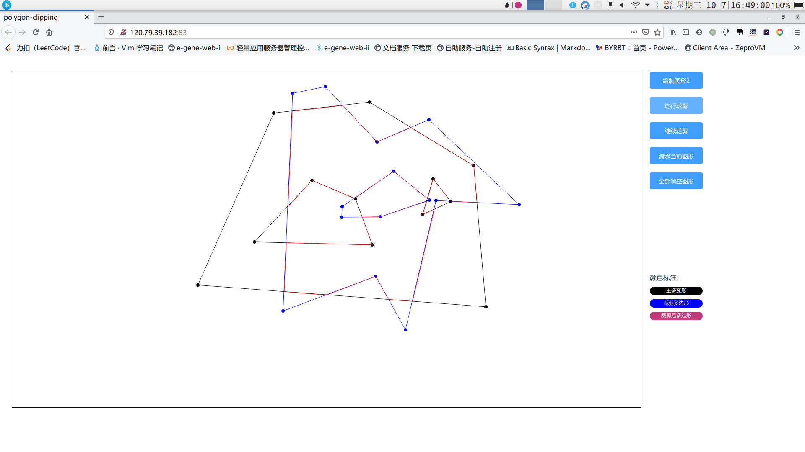
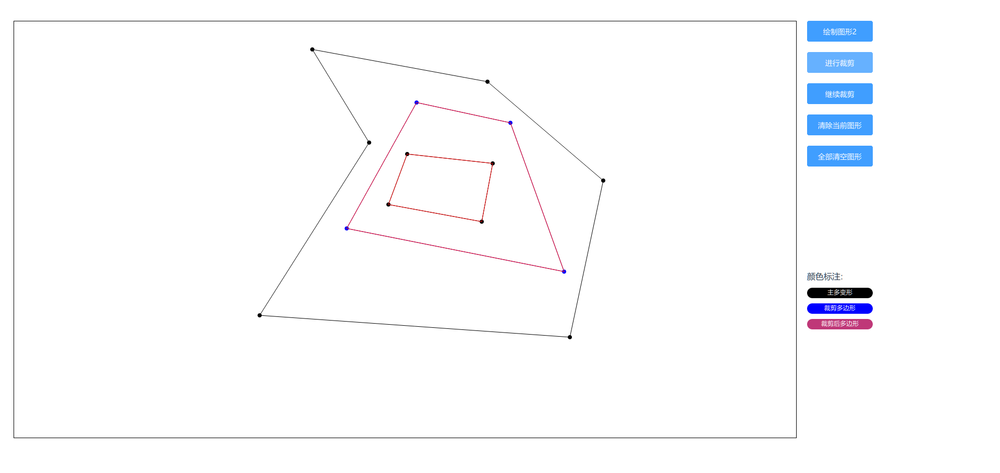

# 多边形裁剪实验报告
李胜涛 2017013618

## 实验环境
* Node v10.17.0
* yarn 1.19.2

## 运行方法
1. 访问http://120.79.39.182:83
2. 在根目录下执行
```shell script
  yarn install
  yarn serve
```
之后访问运行成功给出的本地链接即可

## 交互方法
首先绘制的为裁剪窗口边框，颜色为黑色。之后点击绘制图形2，开始绘制主多变形，左键添加点，右键闭合。允许每个多边形有多个互不相交的内环，点击进行裁剪显示裁剪结果，点击继续裁剪将上次结果作为裁剪窗口显示。  

非法输入：
1. 每个多边形允许有多个内环，但只有一个外环。
2. 内环之间互不相交，并且与外环不相交。
3. 不允许内环之中嵌套内环，包括裁剪窗口的内环和主多变形的内环也不允许嵌套。
4. 如果需要继续裁剪需要上次得到的结果不包含多个外环并且有结果。
5. 多边形边框以及任何内环要求至少拥有三个顶点

## 结果显示



## 算法描述
### 裁剪算法
使用`Weiler Atherton` 算法。
输入为两个多边形，输出为多个多边形，该算法要求判断多边形顶点顺逆时针，这里采用计算多边形面积的方法来进行判断。同时需要判断交点为出点还是入点，这里采用叉乘的方式，若该点为主多边形向量A与裁剪多边形向量B的交点，通过计算`A × B`叉乘结果，若为负，则是入点，否则为出点。

### 线段交点算法
采用直线的一般式方程求两直线的交点，直线的一般式为`Ax+By+C=0`    
`A = y2 - y1`，`B = x1 - x2`，`C = x2y1-x1y2`，交点坐标为：  
`x = (c2 * b1 - c1 * b2) / (a1 * b2 - a2 * b1)`  
`y = (c1 * a2 - c2 * a1) / (a1 * b2 - a2 * b1)`
之后判断该交点是否在线段上即可。
